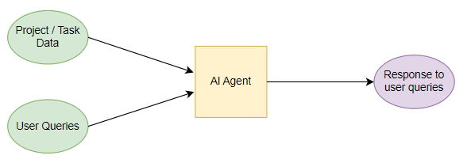
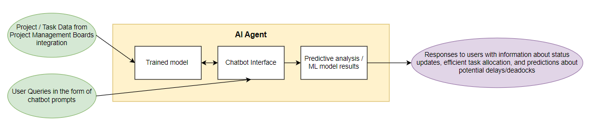
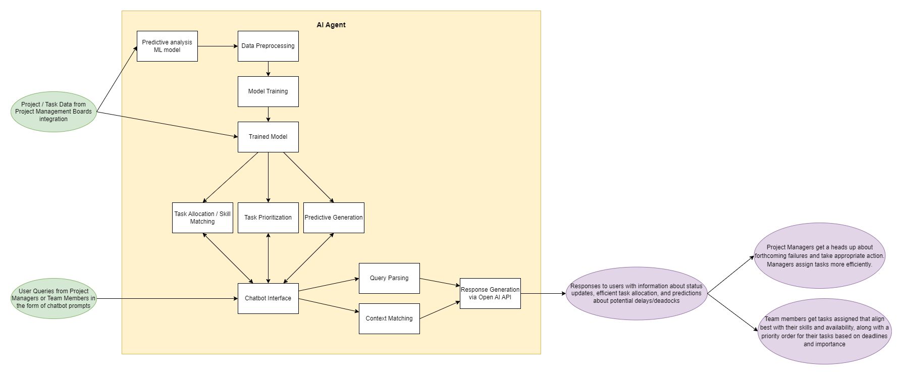

## **Design D0:**

In this highest level view, we have several inputs from the user, being Project data and user queries which is then passed to the AI agent. Then the output is the response the AI generates to the queries in a well-formatted file.

## **Design D1:**

## **Design D2:**

